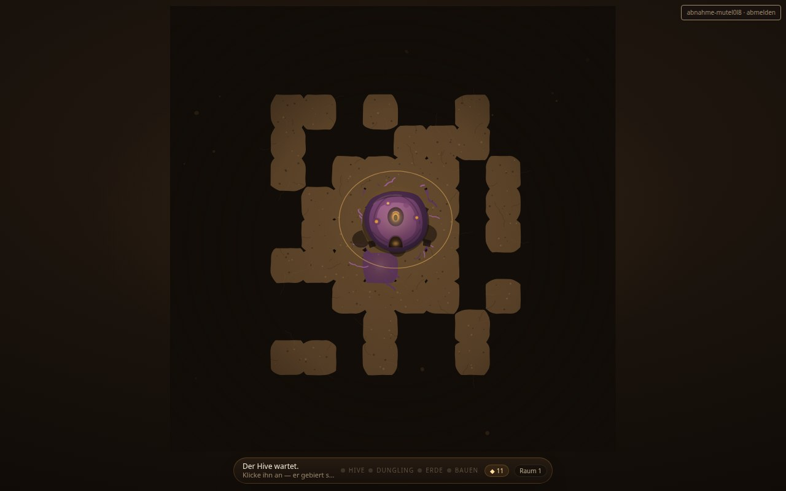
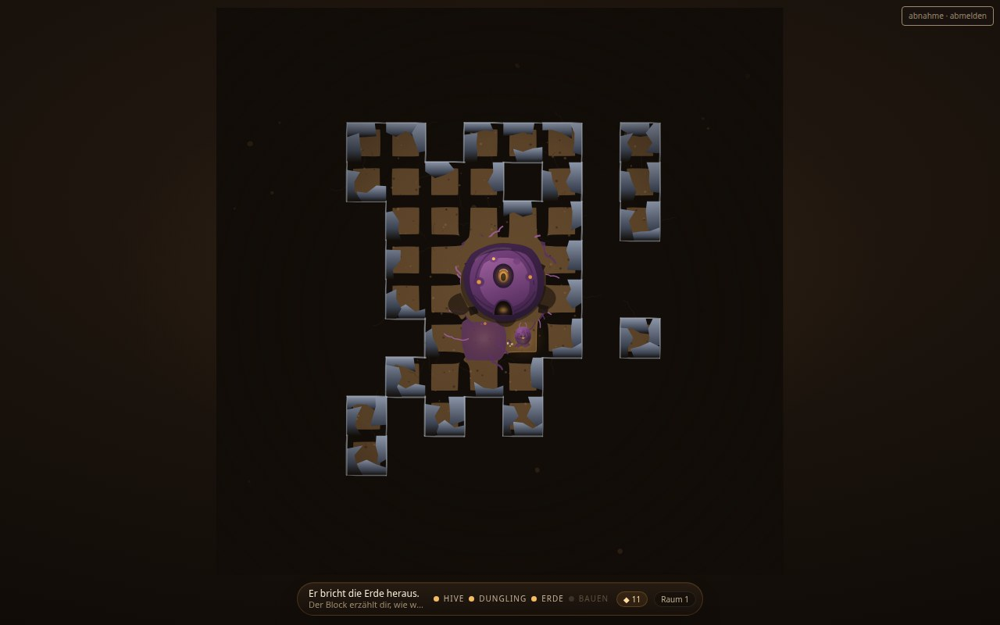
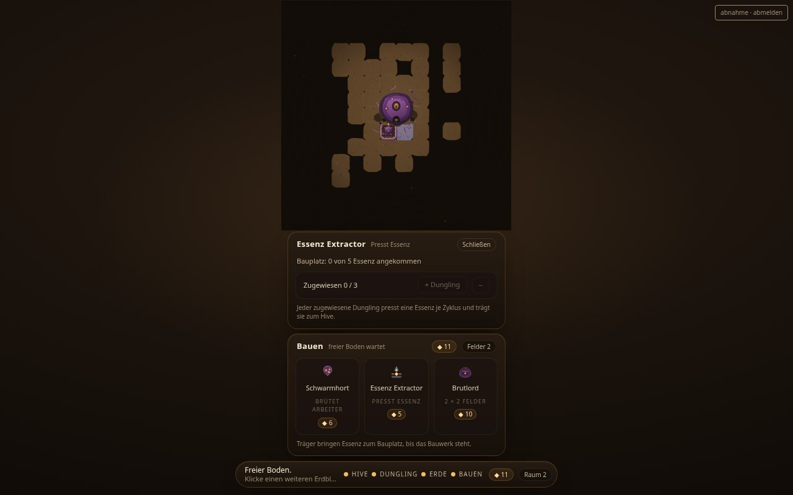
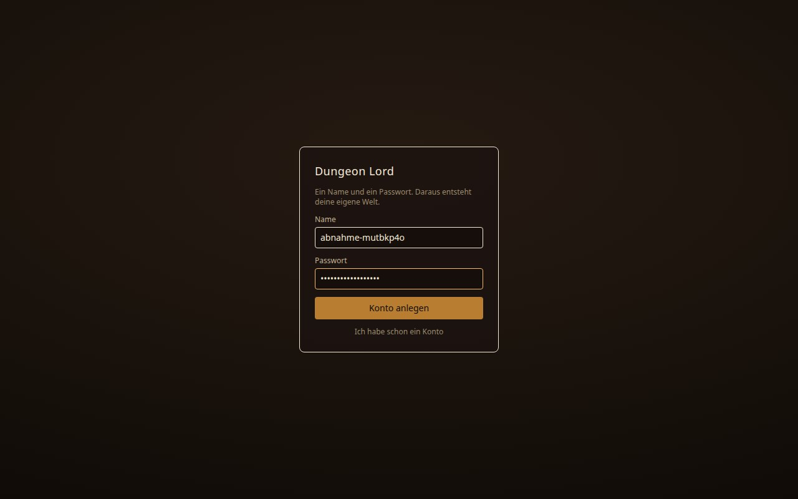
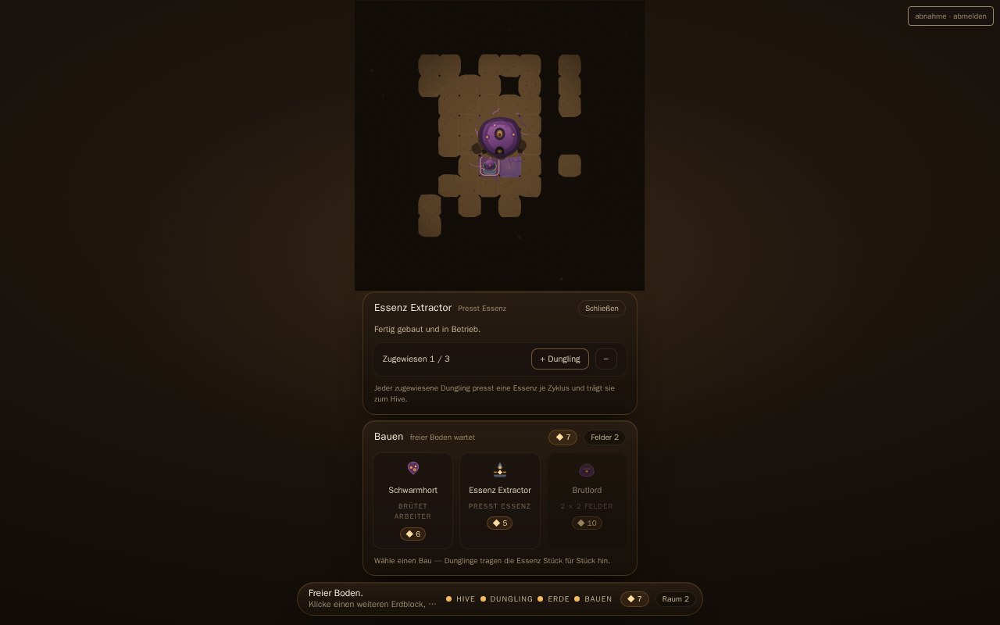
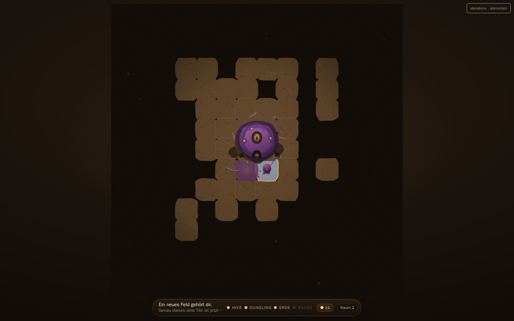
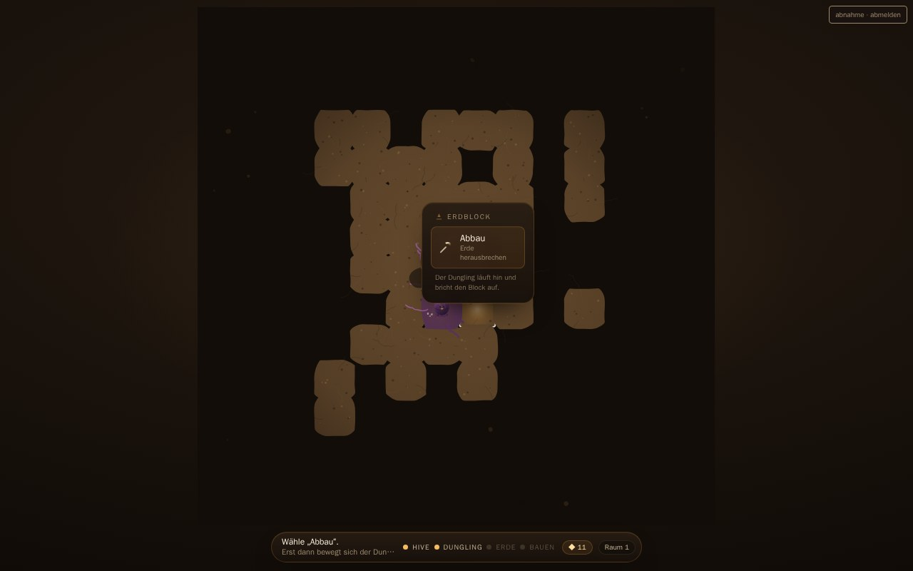

  
  <h1>Brutelord: The Feral Cycle</h1>
  
<em>Ein Handbuch für die Welt, die du nicht sehen solltest.</em>

---

  
  <h2>Die Senke</h2>

In der Mitte der Karte sitzt der Hive. Vier Felder. Ein Puls, der von innen nach außen drückt.

Du klickst ihn an. Fünf Sekunden später kriecht ein Dungling aus dem Loch, läuft los, findet einen Erdblock und gräbt ihn ab. Was übrig bleibt, gehört dem Hive.

Und der Hive fängt sofort an, sich reinzufressen.

Er frisst den Boden, den du gegraben hast, und schickt Wurzeln in die Nachbarfelder. Zehn Sekunden lang nimmt ein Feld die Hive-Farbe an, fünf Sekunden ruht es, dann stoßen die Tentakel weiter. **Eingenommen wird nur abgebauter Boden.** Unberührte Erde wird sichtbar gemacht und nie genommen — der Hive umkreist den Raum, den du geschaffen hast, und beißt sich an jedem echten Schritt die Zähne aus.

---

  
  <h2>Ein Fleck im Nichts</h2>

Mehr sehen kostet. Du musst jedes Feld graben, bevor du es siehst. Graben bindet Zeit, Essenz, Arbeitskräfte — und während du das tust, kriechen die Wurzeln schon weiter. Es gibt keine andere Fortschrittsquelle. Keine Abkürzung.

Am Ende steht da ein gebauter Raum von vielleicht zwanzig Feldern, in einer Dunkelheit, die nicht aufhört. Das ist Absicht und kein Mangel.

Unter dem Boden liegen Vorräte: Cluster aus ein bis drei Feldern, jeder mit bis zu hundert Essenz. Sie sind nicht sichtbar, solange die Wurzeln kein Nachbarfeld einnehmen. Und ein Cluster ist **ein Schlag, kein fließender Vorrat** — der Pool schrumpft mit deinem Grabfortschritt, und im letzten Takt trifft er exakt die Null. Der Vorrat stirbt mit dem Schlag, den du geführt hast. Das ist das Todessignal, und es ist nur erreichbar, wenn der Vorrat ein Schlag ist.

---

  
  <h2>Das Tier, das gräbt</h2>

Du bist kein Herrscher. Du bist kein König. Du bist ein Tier, das sich durchfrisst.

Der Hive presst passiv eine Essenz alle zehn Sekunden, gedeckelt auf fünfundzwanzig für das ganze Spiel. Die Obergrenze ist der Grund, warum es ein Puffer ist und kein Endgame.

Dein Konto ist ein Name und ein Passwort, und daraus entsteht deine Welt — gleiche Zugangsdaten ergeben gleiche Welt, auch nach dem Neuladen.

**Den Spielstand gibt es jetzt.** Hive, Vorräte, Bauten und beide Ressourcenkreisläufe werden gespeichert, aber nur, wenn sich wirklich etwas geändert hat — und nicht öfter als nötig. Er überlebt das Neuladen und das Abmelden. Er liegt noch im Browser; auf einen anderen Rechner folgt er dir noch nicht. Das ist die nächste Naht, und sie ist benannt.

---

  
  <h2>Das Labor am Ende der Senke</h2>

Der Brutlord ist die Senke des ganzen Spiels: vier Essenz gegen einen Stein, dessen Inhalt du erst einmal nicht kennst.

Ein Stein entsteht aus einem Seed — nie aus einem Würfelwurf. Derselbe Seed, derselbe Stein. Neuladen ist kein Losgriff, es ist eine Wiederholung. Ein frischer Stein heißt `???`. Erst das Einbauen in einen Körper lüftet seinen Namen. Die Farbe verrät die Seltenheit, lange bevor du weißt, was drin steckt.

Und hier ist der eigentliche Reiz: **die Optik folgt der Formel Stein-Seed plus Slot, der Effekt nicht.** Derselbe Stein in den Armen wird zur Faust, im Bein zum Schneckenfuß. Seltenheit, Trait und Fähigkeiten bleiben bitgleich. Es gibt keine Ausrüstung, die nur stärker ist — es gibt Experimente.

---

  
  <h2>Warum das kein Spieleaffe-Spiel ist</h2>

Weil die Arbeit in den Systemen liegt, nicht in der Menge. Ein Spiel, das nur Inhalt nachfüllt, hat irgendwann eine Zahl — und dann ist es vorbei. Dieses hat Begründungen. Keine Nachfüllung.

**Nichts wird gewürfelt.** Die Wahrheit des Bodens liegt in der Erde selbst. Jede Koordinate trägt ihre eigene Geschichte — nicht durch Zufall, sondern durch das, was schon da war. Was du einmal siehst, bleibt sichtbar. Die Welt vergisst nicht.

**Grün ist keine Farbe des Sieges.** Eine Welt, die nur grün leuchtet, hat noch nicht geblutet. Jede Regel muss brechen dürfen, damit man weiß, was sie schützt. Der Beweis liegt im Bruch.

**Keine Zahl wird gerundet.** Ein Vorrat stirbt exakt bei Null. Nicht bei "fast Null". Nicht bei "ungefähr leer". Die Null ist der einzige ehrliche Zustand.

---

  
  <h2>Die Welt unter dem Boden</h2>

Weit draußen, bei 47,47, steht eine Leiter. Sie zeigt sich erst, wenn die Wurzeln sie erreichen — und sie ist kein Dekor mehr. Sie steht in jeder Etage an derselben Stelle, liegt unter Gestein, und wer sie freigräbt, steigt hinunter. Oben trägt sie dich frei bis zur tiefsten Etage der Leiter; jede Etage darunter kostet Blutstein, und Blutstein kommt nur aus einem Raid gegen einen fremden Hive. Genau dort beginnt die Ader des Aethers, der die Körperform des Hive weitertreibt.

Der Bildschirm zeigt 13 × 13 Felder um den gebauten Raum. Wie tief der Dungeon reicht, entscheidet nicht das Sichtfeld, sondern die Welt selbst. 4.096 Felder. Du siehst dreizehn mal dreizehn davon, ein Fenster, das dem gebauten Raum folgt und mitwandert. Der Rest bleibt Dunkelheit. Bis die Wurzeln kommen.

---

  <h2>Ehrliche Einschätzung</h2>

Mehr Spiel gibt es nicht. Nicht jetzt. Vielleicht nie.

Was hier zählt, ist nicht die Anzahl der Features. Es ist, ob der Unterbau hält. Du kannst jede Entscheidung nachvollziehen. Kein Modul ist so groß, dass du dich darin verlierst.

Dafür gibt es 4.096 Felder, von denen du am Ende vielleicht zwanzig siehst. Wer mehr sehen will, muss graben.

---

  <h2>Portal zurück</h2>

Wenn du wissen willst, wie das hier zusammenhält: [`Docs/ARCHITEKTUR.md`](Docs/ARCHITEKTUR.md) erklärt das Warum. Keine Abkürzung. [`Docs/WORKFLOW.md`](Docs/WORKFLOW.md) erklärt die Wächter, [`Docs/GOVERNANCE.md`](Docs/GOVERNANCE.md) die Regeln, [`Docs/PITFALLS.md`](Docs/PITFALLS.md) die Fehler, die schon einmal zugeschlagen haben, und [`Docs/ROADMAP_OPEN.md`](Docs/ROADMAP_OPEN.md) was als Nächstes gebaut wird — [`Docs/CHECKPOINTS.md`](Docs/CHECKPOINTS.md) was wann geliefert wurde.

MIT-Lizenz. Copyright 2026 Vannon.
